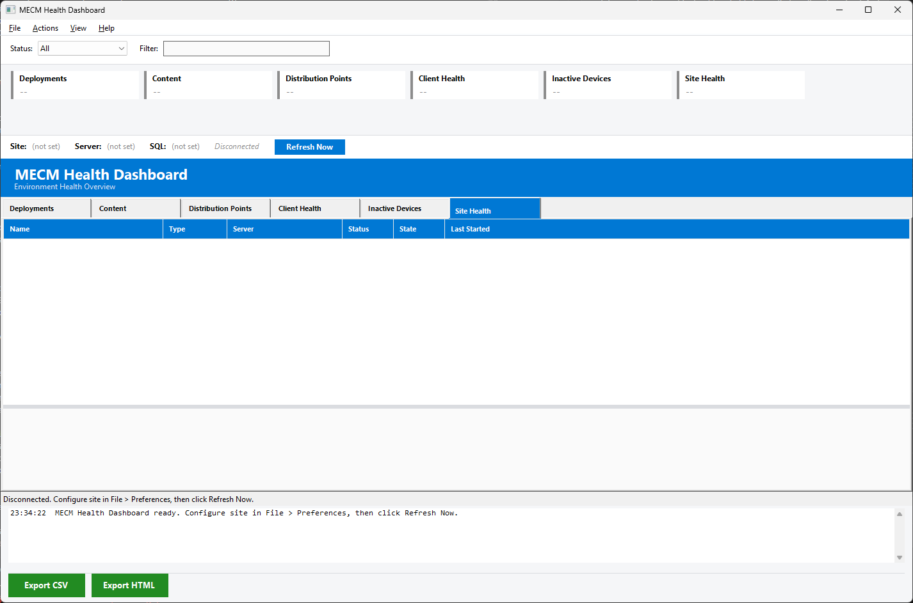

# MECM Health Dashboard

A WinForms-based PowerShell GUI that consolidates MECM (Configuration Manager) environment health into a single dashboard. View deployment status, content distribution failures, DP availability, client health, inactive devices, and site component status with auto-refresh and color-coded summary cards.



## Requirements

- Windows 10/11
- PowerShell 5.1
- .NET Framework 4.8+
- Configuration Manager console installed (ConfigurationManager PowerShell module)
- SQL Server access (for client health and inactive device queries)

## Quick Start

```powershell
powershell -ExecutionPolicy Bypass -File start-mecmhealthdashboard.ps1
```

1. Open **File > Preferences** and enter your Site Code, SMS Provider, and SQL Server
2. Click **Refresh Now** or wait for the auto-refresh timer

## Features

### Summary Cards

Six color-coded cards at the top provide at-a-glance environment status:

| Card | Data Source | Key Metric |
|------|------------|------------|
| **Deployments** | CM cmdlets | Failed deployment count |
| **Content** | WMI | Content items with distribution failures |
| **DPs** | CM cmdlets + WMI | Offline/degraded DP count |
| **Clients** | SQL | Unhealthy client count |
| **Devices** | SQL | Inactive device count (configurable threshold) |
| **Site** | WMI | Components in warning/critical state |

Cards are green (healthy), yellow (warning), or red (critical). Click any card to jump to its detail tab.

### Tabbed Detail Views

| Tab | Columns | Detail Panel |
|-----|---------|-------------|
| **Deployments** | Name, Type, Collection, Purpose, Targeted, Success, Failed, InProgress, Unknown, % Compliant | Per-device status drill-down |
| **Content** | ContentName, Type, PackageID, TotalDPs, Installed, Failed, InProgress | Failures-only summary view |
| **Distribution Points** | DPName, SiteCode, Status, TotalContent, FailedContent, IsPullDP | DP detail info |
| **Client Health** | DeviceName, HealthState, ActiveStatus, LastOnline, LastDDR, LastPolicyRequest, LastHWInventory, ClientVersion | Client detail info |
| **Inactive Devices** | DeviceName, LastOnline, LastDDR, DaysSinceContact, OperatingSystem, ClientVersion | Configurable threshold (7-90 days) |
| **Site Health** | Name, Type, MachineName, Status, State, AvailabilityState, LastStarted | Component/system detail info |

### Data Access

Three data paths, used where each is strongest:

- **CM cmdlets** (via PSDrive): deployment and DP data
- **WMI** (via Get-CimInstance): bulk content status, site components, site systems
- **SQL** (via Invoke-Sqlcmd): client health and inactive device data (queries `v_CH_ClientSummary.LastOnline`; older MECM versions may use `LastActiveTime` -- see Troubleshooting)

### Auto-Refresh

- Configurable interval: 5, 10, 15, 30, or 60 minutes (default 15)
- Status bar countdown to next refresh
- Pause/resume via Actions menu
- Manual refresh resets the timer

### Adaptive Filter Bar

Filter controls change based on the active tab:

- **Deployments**: Type (Application/SoftwareUpdate/Package/TaskSequence) + status + text
- **Content**: Status (Failed/InProgress) + text
- **DPs**: Status (Offline/Warning/OK) + text
- **Client Health**: Health state (Healthy/Unhealthy/Inactive) + text
- **Inactive Devices**: Threshold (7/14/30/60/90 days) + text
- **Site Health**: Status (Critical/Warning/OK) + text

### Export & Reporting

- **CSV** -- Full grid data for the active tab
- **HTML** -- Self-contained styled report with color-coded status cells

### UI

- Dark mode and light mode with full theme support
  - Custom ToolStrip renderer
  - Owner-draw tab headers with ClearType anti-aliasing
- Color-coded grid rows (red = critical, orange = warning, green = healthy)
- Detail panels with RichTextBox info and sub-grids
- Live log console showing query progress
- Window position, size, splitter distance, and active tab persistence across sessions

## Project Structure

```
mecmhealthdashboard/
  start-mecmhealthdashboard.ps1      Main WinForms application
  Module/
    MECMHealthDashCommon.psd1         Module manifest (v1.0.0)
    MECMHealthDashCommon.psm1         Core module (24 exported functions)
  Logs/                               Session logs (auto-created)
  Reports/                            Exported reports
```

## Preferences

Stored in `MECMHealthDash.prefs.json`. Accessible via File > Preferences.

| Setting | Description |
|---------|-------------|
| DarkMode | Toggle dark/light theme (requires restart) |
| SiteCode | 3-character MECM site code |
| SMSProvider | SMS Provider server hostname |
| SQLServer | SQL Server hostname for CM database |
| AutoRefreshMinutes | Auto-refresh interval (5, 10, 15, 30, 60) |
| InactiveThresholdDays | Days since last DDR to consider a device inactive |

## Troubleshooting

**Client Health / Inactive Devices tabs are empty**

- Verify your SQL Server is configured in File > Preferences
- Check the Logs folder for SQL error messages (e.g., `Client health SQL query failed:`)
- If the error mentions an invalid column name, your MECM version may use `LastActiveTime` instead of `LastOnline` in `v_CH_ClientSummary`. Update the column name in `Module/MECMHealthDashCommon.psm1` in both `Get-ClientHealthSummary` and `Get-InactiveDevices`

## License

This project is licensed under the [GNU General Public License v3.0](LICENSE).

## Author

Jason Ulbright
