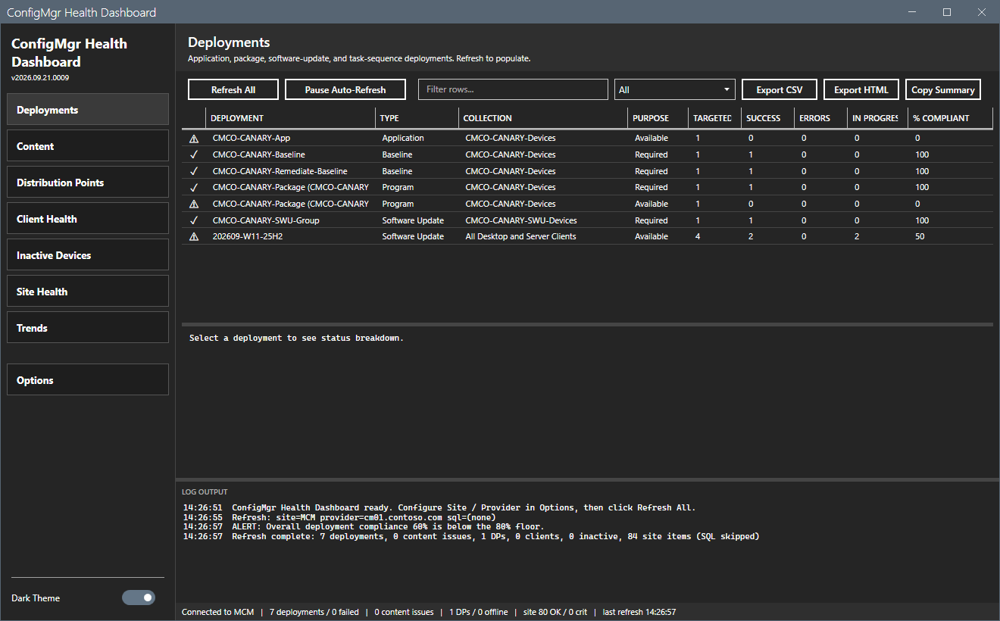

# MECM Health Dashboard

[](https://github.com/jasonulbright/mecm-health-dashboard/releases/latest)
[](https://github.com/jasonulbright/mecm-health-dashboard/releases)
[](#requirements)
[](LICENSE)

A PowerShell + WPF (MahApps.Metro) GUI that consolidates MECM (Configuration Manager) environment health into a single dashboard. View deployment status, content distribution failures, DP availability, client health, inactive devices, and site component status with auto-refresh, glyph-based status indicators, and per-view export.



## Requirements

- Windows 10/11
- PowerShell 5.1
- .NET Framework 4.7.2+
- Configuration Manager console installed (ConfigurationManager PowerShell module)
- SQL Server access (optional; for client health and inactive device queries)

## Quick Start

```powershell
powershell -ExecutionPolicy Bypass -File start-mecmhealthdashboard.ps1
```

1. Click **Options** in the sidebar and enter your Site Code, SMS Provider, and (optional) SQL Server.
2. Click **Save Options**.
3. Click **Refresh All** in the action bar (or wait for the auto-refresh timer).

## Layout

The shell is a MahApps.Metro WPF window with sidebar navigation. There is no menu bar.

### Sidebar

| Button | View |
|--------|------|
| **Deployments** | Application / package / software-update / task-sequence deployments |
| **Content** | Content distribution: only items with failed or in-progress DP-content pairs |
| **Distribution Points** | DP roster with site, status, and pull-DP flag |
| **Client Health** | Per-device CCM health (SQL-backed) |
| **Inactive Devices** | Devices exceeding the inactivity threshold (SQL-backed) |
| **Site Health** | Combined components + site-system roles (WMI summarizers) |
| **Trends** | Rolling 7 / 30 / 90 day history charts per metric (captured each refresh) |
| **Options** | Connection, refresh interval, inactivity threshold, alerts, About |

A theme toggle (Dark / Light) sits at the bottom of the sidebar.

### Action bar (per-view)

- **Refresh All** -- runs all six health queries against the configured site
- **Pause / Resume Auto-Refresh** -- toggles the recurring timer
- **Filter** -- substring match across the active view's text columns
- **Status filter** -- All / OK / Warning / Failed
- **Export CSV / HTML / Copy Summary** -- export the active view or copy the rollup

### Status indicators

Status is conveyed via a glyph in the first column (no row coloring):

- `✓` OK / Healthy
- `⚠` Warning / In progress / Inactive
- `✗` Error / Failed / Critical / Unhealthy
- `⋯` Unknown / no targets

## Detail Views

| View | Columns | Detail Panel |
|------|---------|-------------|
| **Deployments** | Glyph, Name, Type, Collection, Purpose, Targeted, Success, Errors, In Progress, % Compliant | Per-deployment status breakdown |
| **Content** | Glyph, Name, Type, PackageID, TotalDPs, Installed, Failed, In Progress | Content + DP totals |
| **Distribution Points** | Glyph, DPName, Site, Status, TotalContent, FailedContent, IsPullDP | DP info |
| **Client Health** | Glyph, Device, HealthState, Active, Last Online / DDR / Policy / HW Inv, Client Version | Client info |
| **Inactive Devices** | Glyph, Device, Last Online, Last DDR, Days Since, OS, Client Version | Contact history |
| **Site Health** | Glyph, Name, Type, Server, Status, State, Last Started | Component / system info |

## Data Access

Three data paths, used where each is strongest:

- **CM cmdlets** (via PSDrive): deployment and DP data
- **WMI** (via Get-CimInstance): bulk content status (`SMS_PackageStatusDistPointsSummarizer`), site components (`SMS_ComponentSummarizer`), site systems (`SMS_SiteSystemSummarizer`) -- no CM cmdlet equivalents exist for these summarizer / health aggregation classes
- **SQL** (via Invoke-Sqlcmd): client health and inactive device data (`v_CH_ClientSummary` joined to `v_R_System`; health pass/fail from `LastEvaluationHealthy`, activity from `LastActiveTime`)

The refresh runs in a background STA runspace so the UI stays responsive and a progress overlay animates while data is loading.

## Auto-Refresh

- Configurable interval: 5, 10, 15, 30, or 60 minutes (default 15)
- Pause / Resume from the action bar
- Manual refresh resets the timer

## Project Structure

```
mecm-health-dashboard/
  start-mecmhealthdashboard.ps1    PS+WPF shell (entry point)
  MainWindow.xaml                   MahApps.Metro WPF layout
  Lib/                              MahApps.Metro DLLs (vendored)
  Module/
    MECMHealthDashCommon.psd1       Module manifest
    MECMHealthDashCommon.psm1       Core module (25 exported functions)
  Logs/                             Session, alert, and crash logs (auto-created)
  History/                          Metrics history CSV feeding the Trends view (auto-created)
  Reports/                          Exported CSV / HTML reports
```

## Trends and Alerts

Every completed refresh appends a snapshot of all health counts to
`History/metrics-history.csv` (180-day retention). The **Trends** view charts
any metric over 7 / 30 / 90 days; **Export CSV** exports the charted series.

When enabled (**Options > Alerts**), threshold alerts are evaluated after each
refresh and fire when a metric *crosses into* breach: any critical site
component / site system, any critical distribution point, any failed
DP-content pair, or overall deployment compliance below the configured floor.
Delivery is local-only: a Windows toast plus an audit line in
`Logs/HealthDash-alerts.log` and the log drawer. An alert repeats only after
the metric recovers and breaches again.

## Preferences

Stored in `MECMHealthDash.prefs.json` next to the script. Edited via the **Options** view.

| Setting | Description |
|---------|-------------|
| DarkMode | Dark.Steel (true) or Light.Blue (false) MahApps theme |
| SiteCode | 3-character MECM site code |
| SMSProvider | SMS Provider server FQDN |
| SQLServer | SQL Server hostname for CM database (blank = skip SQL views) |
| AutoRefreshMinutes | Auto-refresh interval (5, 10, 15, 30, 60) |
| InactiveThresholdDays | Days since last DDR to consider a device inactive (7, 14, 30, 60, 90) |
| AlertsEnabled | Evaluate threshold alerts after each refresh (true/false) |
| AlertCompliancePct | Deployment compliance floor for alerts (70, 80, 90, 95) |

## Troubleshooting

**Client Health / Inactive Devices views are empty**

- Verify your SQL Server is configured in **Options**.
- Check the `Logs/` folder for SQL error messages (e.g., `Client health SQL query failed:`).
- SQL queries run with no timeout (`-QueryTimeout 0`); WMI queries use the CIM default operation timeout. If queries fail, check network connectivity to the SQL / WMI server.
- If the error mentions an invalid column name, note the exact message and your MECM version -- the queries target the current-branch `v_CH_ClientSummary` schema (`LastActiveTime`, `LastEvaluationHealthy`, `ClientActiveStatus`, `LastDDR`, `LastHW`, `LastPolicyRequest`).

**Deployments view incomplete or missing rows**

- The current ConfigurationManager cmdlet library returns unbounded query results by default. If rows are missing, verify the CM console user account has permission to view all deployments.

**The window opens but refresh does nothing**

- Check the Site Code and SMS Provider in **Options**. Until both are set, **Refresh All** logs a warning and returns early.

## License

MIT. See [LICENSE](LICENSE).

## Author

Jason Ulbright.
